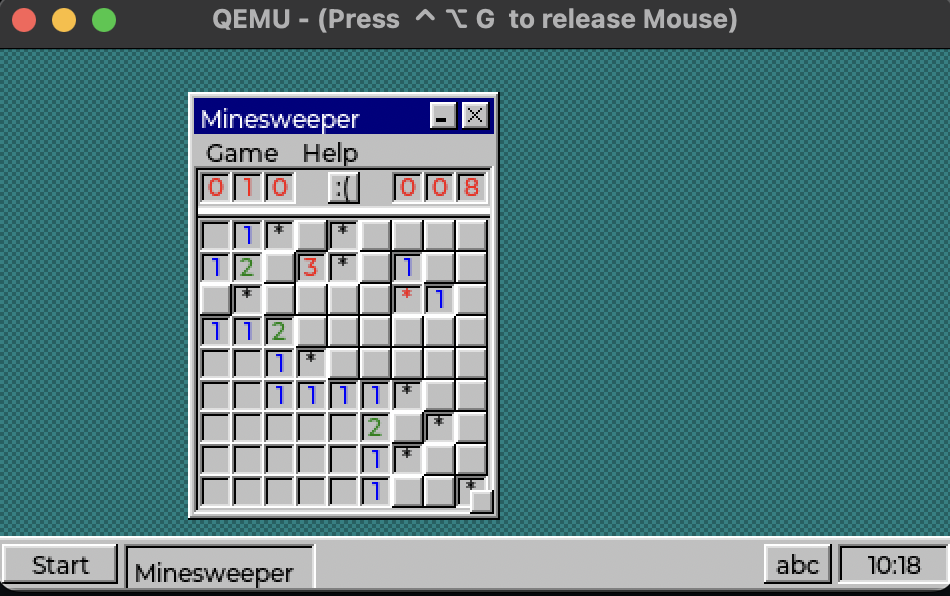

# zephyr-desktop

[](https://github.com/beriberikix/zephyr-desktop/actions/workflows/build.yml)

A retro desktop shell on [Zephyr RTOS](https://zephyrproject.org) +
[LVGL](https://lvgl.io). Overlapping draggable windows with hand-built Win95-era
chrome, a taskbar with a launcher and a clock, and **apps as `.llext` extensions
discovered on a filesystem and loaded at runtime** — not linked into the image.



It runs on `qemu_cortex_a53`, natively on macOS in a real window with a real
mouse, and it runs on an M5Stack CoreS3 — a 320×240 touchscreen you can hold.

## Try it

You need Python 3, CMake, Ninja and `dtc` — on macOS,
`brew install cmake ninja dtc` — plus `pip install west`. Then:

```sh
git clone https://github.com/beriberikix/zephyr-desktop
cd zephyr-desktop
west init -l manifest       # this repo is the workspace; west.yml is in manifest/
west update                 # clones Zephyr and the modules into ./zephyr, ./modules
west packages pip --install
```

Then the **Zephyr SDK**, whose version is pinned in `zephyr/SDK_VERSION` (this
release wants 1.0.1). Download the matching release from
[sdk-ng](https://github.com/zephyrproject-rtos/sdk-ng/releases), unpack it, and
run its `setup.sh` — that registers it where CMake looks, so you do not need to
set `ZEPHYR_SDK_INSTALL_DIR`. The SDK also supplies the QEMU that runs it.

```sh
west build -b qemu_cortex_a53 app
west build -t run
```

A window opens. Click **Start**.

Everything is in that menu: a text editor, a file browser, Minesweeper, and two
toy apps. One entry, `badabi`, is *supposed* to refuse to launch — it declares
an unsupported ABI version, and exists so the version gate gets exercised for
real. [docs/using.md](docs/using.md) is the tour, including the one gesture you
will not guess: **hold** a Minesweeper square to flag it.

## What makes it interesting

**Apps are loaded at runtime, from a filesystem.** The launcher enumerates
`.llext` files it finds on disk; clicking one relocates and loads it, and
closing its last window unloads it again. Delete one from the card and drop your
own in — the desktop has no compiled-in list of apps. Writing one is
[about forty lines](zapps/hello/hello.c).

**The ABI is a vtable, not a symbol pile.** The desktop exports exactly **one**
symbol where Zephyr's defaults would export 172. Apps get opaque,
generation-counted handles validated against their owner and never touch LVGL,
so the permission shim is the only linkable route to the filesystem.

**One app waits on a language model without stopping the desktop.** Clippy asks
a Hugging Face Space about Zephyr; the Space runs its model on CPU and takes
tens of seconds. Everything in the ABI before it finished before it returned,
which is fine until a callback on the drawing thread wants an answer from the
internet. ABI 0.8 adds a request that returns immediately and an event that
arrives later, on the same queue keystrokes use — so the clock keeps ticking and
the other windows keep dragging while a paperclip thinks.


The paperclip is drawn by the desktop, not shipped by the app: ABI 0.9 lets a
zapp *name* a stock picture rather than carry one, which is the bargain a Win95
message box already struck with `MB_ICONINFORMATION`. A zapp has no framebuffer,
no `lv_obj_t` and not one LVGL symbol to link against, so drawing is the
desktop's job by construction.

CI builds the zapp, checks it imports nothing, launches it, unloads it and takes
that screenshot on every run. See [docs/clippy.md](docs/clippy.md) — including
the bugs it found on the way in, none of which were in Clippy.

**Nothing is destroyed during dispatch.** An app closing its own window is
running on a stack frame inside code that unloading would free. Every destroy is
queued and drained from the main loop. It is the rule the whole design bends
around, and [docs/architecture.md](docs/architecture.md) explains why.

## Limits worth knowing before you start

- **Permissions are advisory.** With no MMU, a loaded extension is trusted code
  in the kernel address space. The filesystem shim is a contract, not a security
  boundary. Hardening via `CONFIG_USERSPACE` is deferred, not designed out.
- **Apps are callback-driven and single-threaded.** One that loops forever in a
  callback hangs the desktop.
- **Windows resize from the bottom-right corner only.** No maximise, no
  snapping, no notifications, no sound, no theming engine, one hardcoded palette.
- **The clock is a fiction** on boards with no RTC, and there is no date in the
  ABI at all.
- **Networking is off by default and has no TLS.** `CONFIG_ZD_NET=y` adds the
  0.8 HTTP calls; `http_request()` refuses `https://` rather than downgrading
  it, because a desktop with no trust store should not pretend otherwise. The
  Clippy app reaches its Space through `tools/hf-proxy.py` on the development
  host, which terminates TLS there. `CONFIG_ZD_CLIPPY=y` builds the app without
  the TCP stack, which is how its UI gets worked on.

Also: Zephyr is pinned to a `main` commit rather than a release, because the
QEMU display and pointer stack this needs is in no release tag yet; and
`native_sim` is not a target and cannot be, because it cannot load extensions.
Both are explained in [docs/architecture.md](docs/architecture.md).

## Hardware

| Board | State |
|---|---|
| `qemu_cortex_a53` | The development target. Graphical, pointer-driven, runs on macOS with no VM. |
| `m5stack_cores3/esp32s3/procpu` | **Runs on silicon.** 320×240 touch, Xtensa, apps loaded off a microSD card. |
| `mimxrt1060_evk/mimxrt1062/qspi` | Builds, headless, never run on hardware. |

[docs/hardware.md](docs/hardware.md) has the runbooks — including how to
reproduce the CoreS3's screen geometry under QEMU when you do not have one.

## Documentation

| | |
|---|---|
| [docs/using.md](docs/using.md) | The tour: windows, the apps, and the gestures |
| [docs/writing-a-zapp.md](docs/writing-a-zapp.md) | Build your own, and the four traps |
| [docs/abi.md](docs/abi.md) | The app ABI: versioning, handles, ordering, what it refuses to promise |
| [docs/architecture.md](docs/architecture.md) | How the desktop works inside |
| [docs/hardware.md](docs/hardware.md) | Board runbooks and porting |
| [docs/clippy.md](docs/clippy.md) | Asking a model from a zapp: the 0.8 network ABI, and why TLS is the proxy's job |
| [CONTRIBUTING.md](CONTRIBUTING.md) | Building, testing, and the rules that are easy to get wrong |
| [CHANGELOG.md](CHANGELOG.md) | What changed per release |
| [docs/history.md](docs/history.md) | How it was built, and what the plan got wrong. Not required reading. |

("zapp" is what this project calls an app, and `zapps/` is where they live —
Zephyr's convention is that `app/` holds the application source, and this
project has one of those too. A sibling `apps/` reads as a typo for it every
single time.)

## Licence

Apache-2.0, matching Zephyr.
