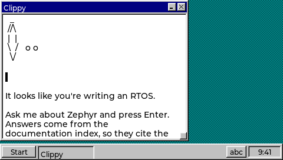
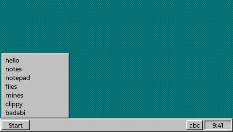

# clippy — asking a model from a zapp

Clippy asks a Hugging Face Space a question about Zephyr and shows the answer.
It is the first zapp that waits on something the desktop does not control.



That image is produced by CI, from a build, on every run -- see
[Screenshots](#screenshots) below. Nothing here is a mock-up.

## Why it needed a new piece of ABI

Every call in the ABI through 0.7 finishes before it returns. That was fine
while a zapp only read a file or drew a window. It stops being fine the moment
a zapp wants an answer from a model: the Space runs its model on CPU and takes
tens of seconds, and a zapp runs as a callback inside `lv_timer_handler()` on
the thread that draws the screen. A blocking call would stop the clock, the
taskbar and every other window for the whole request.

So 0.8 adds three calls and one event:

| | |
|---|---|
| `http_request(url, body, &id)` | starts work, returns immediately |
| `ZD_EV_HTTP_RESPONSE` | the answer, later, from the desktop loop |
| `http_read(id, from, buf, cap)` | copy the body out |
| `http_release(id)` | give the slot back |

This is exactly the shape `input/keys.c` already uses, and for the same reason.
A key arrives on Zephyr's input thread; everything downstream of routing it is
LVGL's, and only the desktop thread may touch LVGL. So keys go on a `k_msgq`
and `zd_keys_pump()` drains them from the loop. An HTTP response is the same
problem with a longer fuse, so it takes the same route: a worker thread, a
queue, and `zd_http_pump()` sitting next to `zd_keys_pump()` in `main()`.

CLAUDE.md says a new input modality inherits the queue. A response arriving 40
seconds after the question is a new input modality.

### Two details that are load-bearing

**The body is not in the event.** `struct zd_event` stays a small fixed thing,
and a zapp never holds a pointer into desktop memory across a dispatch it does
not control. The body lives in a desktop-owned slot until `http_release()`.

**Ownership is resolved on the desktop thread, not the worker.** The worker
compares the owner pointer and never dereferences it. If the instance exits
while a request is in flight, `zd_http_owner_gone()` clears the owner and
`zd_http_pump()` drops the response and frees the slot. A response dispatched
into an extension whose text has been unmapped is the failure mode this project
treats as unacceptable rather than untidy.

## Why the TLS hop is the proxy's job

`tools/hf-proxy.py` runs on the development host and does three things the
device should not have to:

1. **Terminates TLS.** On-device HTTPS means mbedTLS, a CA bundle, and its
   expiry. That is a lot of flash and a lot of maintenance to reach one Space.
2. **Performs Gradio's two-step call.** A prediction is a POST that returns an
   event id, then a GET that streams server-sent events until one says
   `complete`.
3. **Answers in plain text.** This is the one that matters most: it means the
   zapp needs no JSON parser, and a zapp has no libc to write one with.

The device therefore speaks the simplest HTTP there is — POST a question, get
an answer.

`http_request()` **rejects `https://` rather than downgrading it.** Silently
sending in the clear what a caller asked to encrypt is the kind of
helpfulness that ends up in an advisory.

## Running it

```bash
python tools/hf-proxy.py                        # on the development host
west build -b qemu_cortex_a53 app -- -DCONFIG_ZD_NET=y
west build -t run
```

### Without the network

`CONFIG_ZD_CLIPPY` is a separate knob from `CONFIG_ZD_NET`. It defaults to
following it, because an assistant that cannot make a request is not worth the
flash on a board that will never have a network. Forcing it on builds the zapp
with `http_request()` answering `-ENOSYS`:

```bash
west build -b qemu_cortex_a53 app -- -DCONFIG_ZD_CLIPPY=y
```

This is not a degraded mode. The window, the paperclip, its animation, the
question box and the error path are identical; the only difference is which
failure the request reports. It builds in a fraction of the time, cannot fail
for a reason that lives in the IP stack, and is what the screenshots come from.

The proxy binds `0.0.0.0:8080` so QEMU's user-mode alias `10.0.2.2` can reach
it. That address is compiled into `zapps/clippy/clippy.c`; a real device would
point somewhere reachable on its own network.

Point it at the ROS 2 assistant instead:

```bash
python tools/hf-proxy.py --space eoinedge/ros2
```

The proxy is a development tool. No authentication, no rate limiting; do not
expose it to a network you do not control.

## Screenshots

```bash
tools/shot-clippy.sh -d build-ci/clippy -o shots
```

Boots the image headlessly, clicks Start, clicks the clippy row and writes three
PNGs plus the serial console. CI runs it on every build and uploads the results,
so the images in this file are produced by a build rather than pasted in from
someone's laptop and never updated again.



Two things in that script are worth knowing if you change it.

**The click is derived, not eyeballed.** `shot.py` takes fractions of the
screen, and the launcher panel is bottom-anchored above the taskbar and grows
*upward* with the zapp count -- so every row moves when a zapp is added. The
script computes the position from the same constants the C does, and names each
one, so a change to any of them shows up as a wrong click rather than a mystery.

**It then reads the console.** A wrong row is otherwise a perfectly good
screenshot of the wrong window. The launcher logs `launch '<name>'`, which is
the only thing that can say what was actually hit.

Note that `shot.py` runs QEMU with `-net none`. Even on a `ZD_NET` build the
desktop cannot reach a proxy from there, which is why the screenshots come from
the `ZD_CLIPPY` build and show clippy's UI rather than an answer.

## What is verified and what is not

**Verified in CI**, on `qemu_cortex_a53`, `CONFIG_ZD_CLIPPY=y`, every run:

- The zapp builds, and `nm -u clippy.llext` imports nothing but
  `zd_get_host_api`. This is the check that mattered most: the elapsed-seconds
  arithmetic in clippy is exactly the shape that makes GCC reach for a libgcc
  helper nobody wrote, and it does not.
- The launcher discovers seven zapps from the filesystem, through a real click.
- The smoke test launches clippy, opens its window, closes it and unloads the
  extension with the client, handle, open-file and instance counters back at
  their boot values.
- The pixels above.

**Verified on the development host.** The proxy, end to end against the live
Space:

```
  -> How do I define a devicetree binding?
  <- 2809 bytes
```

Real Zephyr documentation with source citations and similarity scores, flattened
out of markdown into something a fixed-width text widget can show.

**Not verified: the two ends joined up.** No run has yet had the desktop fetch
an answer from the proxy and draw it, because the only automated harness for
pixels deliberately runs with no network. The networking build compiles, links
and boots -- the open question about whether `qemu_cortex_a53` could carry
virtio-net at all is settled, and it can -- but a screenshot of a real answer on
the screen needs `west build -t run` and a human.

**Not verified: any of it on hardware.** The CoreS3 has WiFi and is the board
this would be most interesting on. Nobody has tried.

## Three bugs it found on the way in

Worth recording, because none of them were in clippy.

**The window slab.** Five zapps already open eight windows between them, and
`CONFIG_ZD_MAX_CLIENTS` is 8 desktop-wide, so the smoke test was exactly full
before clippy asked for a ninth. Raised to 16 in `smoke.conf` only -- the
default is a statement about how many windows a user plausibly has, and the
smoke test is not a user. The smoke test diagnosed this itself, reporting that
the failure was "not the ABI gate refusing it", which is the check milestone M
added after milestone K predicted precisely this confusion.

**The smoke drain counted the wrong thing.** It waited
`(CLOSE_GRACE_MS / TICK_MAX_MS) + 8` loop *iterations*, which assumes every pass
round the desktop loop sleeps the full `TICK_MAX_MS`. It does not: `main()`
sleeps `MIN(what lv_timer_handler asked for, TICK_MAX_MS)`, so a zapp with a
running LVGL timer shortens every iteration -- while the close grace being
waited for is wall clock. Clippy is the first zapp with a *continuously*
running one (a 400 ms animation), which put the test right on the 2 s boundary:
round 1 drained in 2.14 s and passed, round 2 in 1.84 s and reported a leak of
clients that were about to be reaped anyway. The direction of that error is the
part worth keeping: the same bug would have produced a false **pass** just as
readily, by checking the counters before a real leak had appeared. It waits on
the clock now.

**`shot.py` guessed where QEMU was.** `$ZEPHYR_SDK_INSTALL_DIR/hosttools/...`
with a `~/zephyr-sdk-<version>` fallback -- and on a CI runner the variable is
unset and the SDK is wherever the setup action cached it, so it died naming a
path that had never existed on that machine. `ci-check.sh` had already learned
this and reads the build's own `CMakeCache.txt`; `shot.py` does too now. The
lesson was written down in one tool and not the other.
